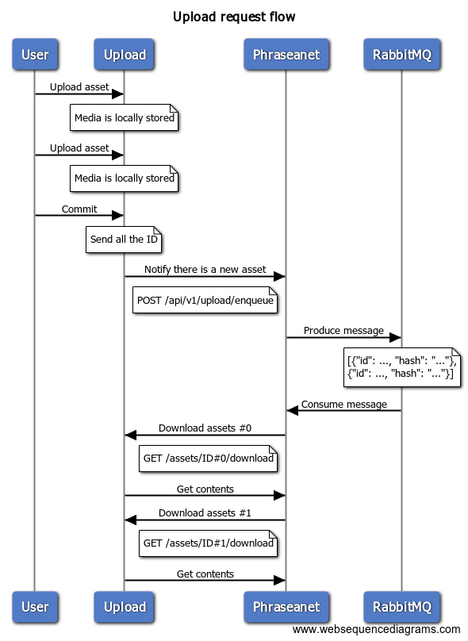

# Request flow

When an asset is uploaded to the upload service, the upload service notifies Phraseanet that there is a new asset to grab.
Then Phraseanet download the media through the upload service.

## Flow



​```sequence
title Upload request flow

User->Upload: Upload asset
note over Upload: Media is locally stored
User->Upload: Upload asset
note over Upload: Media is locally stored
User->Upload: Commit
note over Upload: Send all the ID
Upload->Phraseanet: Notify there is a new asset
note left of Phraseanet: POST /api/v1/upload/enqueue
Phraseanet->RabbitMQ: Produce message
note over RabbitMQ
    [{"id": ..., "hash": "..."},
      {"id": ..., "hash": "..."}]
end note

RabbitMQ->Phraseanet: Consume message
Phraseanet->Upload: Download assets #0
note left of Phraseanet: GET /assets/ID#0/download
Upload->Phraseanet: Get contents
Phraseanet->Upload: Download assets #1
note left of Phraseanet: GET /assets/ID#1/download
Upload->Phraseanet: Get contents
​```
