# Prérequis techniques Phrasea

## Objectif

Présenter l’architecture technique de la solution logicielle Phrasea.

Cette page décrit les différents modules qui la composent, ainsi que les dépendances logicielles et services externes nécessaires à sa mise en œuvre.

Elle s’adresse :

* Aux équipes informatiques souhaitant déployer Phrasea sur leur infrastructure  
* Aux architectes applicatifs désirant intégrer Phrasea  
* Aux architectes techniques désirant intégrer Phrasea  

### Source de l’application Phrasea

Le code source de l’application Phrasea est disponible sur GitHub :

* [**Source de l’application**](https://github.com/alchemy-fr/phrasea)

### Orchestration du déploiement

Phrasea peut être déployé avec Docker/Docker Compose ou sur un cluster Kubernetes. Chaque technologie offre des fonctionnalités de scalabilité et présente ses propres avantages et inconvénients. Selon vos besoins en scalabilité et gestion d’infrastructure, vous pouvez choisir la méthode de déploiement la plus adaptée à votre projet.

#### Docker Compose

Permet un déploiement rapide de Phrasea en environnement de développement ou local. La stack inclut des services externes comme **PostgreSQL**, **Redis**, **Elasticsearch** et **MinIO**. Grâce aux [**profils**](../Configuration/01_env_var.mdx#docker-compose) Docker Compose, vous pouvez sélectionner les services à démarrer, offrant une flexibilité selon les besoins de chaque environnement. Cependant, la scalabilité de la stack sera uniquement verticale.

**Système d’exploitation :** Linux Ubuntu 24.04 LTS, Debian 11

**Versions minimales requises :** 
  - Docker : 28.5.2
  - Docker Compose : 2.40.3
  
Le fichier Docker Compose est inclus dans le dépôt GitHub Phrasea pour faciliter le déploiement en environnement de développement :

* [**Déploiement Docker Compose**](https://github.com/alchemy-fr/phrasea/blob/master/docker-compose.yml)

Vous pouvez également consulter la [page de description des variables d’environnement](../Configuration/01_env_var.mdx#app_env) pour plus d’informations sur les variables disponibles.

#### Kubernetes

Kubernetes est idéal pour les besoins à grande échelle. Phrasea peut être déployé sur plusieurs nœuds pour une scalabilité horizontale.
Pour les déploiements Kubernetes, utilisez les charts Helm disponibles :
* [**Déploiement Helm Phrasea**](https://github.com/alchemy-fr/phrasea-helm-charts)

Versions minimales requises :
  - Kubernetes : 1.29  
  - Helm : v3.17.1  

#### Remarque sur les déploiements Docker et Kubernetes
Les conteneurs fournis dans **Docker Compose** et les **charts Helm** pour Phrasea sont principalement conçus pour le développement et les tests. Pour garantir que ces conteneurs soient adaptés à la production, une personnalisation supplémentaire est nécessaire : optimisation des configurations, sécurisation des accès, gestion des ressources, résilience et supervision adaptées à la production. Ces ajustements sont essentiels avant tout déploiement en production.

Il est fortement recommandé de déléguer les **datastores principaux**—tels que **PostgreSQL** et le stockage objet compatible S3 (servi par **MinIO**)—à des services managés externes pour améliorer les performances, la fiabilité et la scalabilité.

### Images Docker Phrasea

* **Dashboard**  
  - [Image Docker Dashboard](https://hub.docker.com/r/alchemyfr/ps-dashboard/tags)

* **Keycloak**  
  - [Image Docker Keycloak](https://hub.docker.com/r/alchemyfr/ps-keycloak/tags)  
  - [Image Docker Configurator](https://hub.docker.com/r/alchemyfr/ps-configurator)

* **Service Databox**  
  - [API PHP Databox](https://hub.docker.com/r/alchemyfr/ps-databox-api-php/tags)  
  - [Worker Databox](https://hub.docker.com/r/alchemyfr/ps-databox-worker/tags)  
  - [Client Databox](https://hub.docker.com/r/alchemyfr/ps-databox-client/tags)  
  - [API Nginx Databox](https://hub.docker.com/r/alchemyfr/ps-databox-api-nginx/tags)
  - Indexeur Databox (build local uniquement)

* **Service Uploader**  
  - [API PHP Uploader](https://hub.docker.com/r/alchemyfr/ps-uploader-api-php/tags)  
  - [Worker Uploader](https://hub.docker.com/r/alchemyfr/ps-uploader-worker/tags)  
  - [Client Uploader](https://hub.docker.com/r/alchemyfr/ps-uploader-client/tags)  
  - [API Nginx Uploader](https://hub.docker.com/r/alchemyfr/ps-uploader-api-nginx/tags)

* **Service Expose**  
  - [API PHP Expose](https://hub.docker.com/r/alchemyfr/ps-expose-api-php/tags)  
  - [Worker Expose](https://hub.docker.com/r/alchemyfr/ps-expose-worker/tags)  
  - [Client Expose](https://hub.docker.com/r/alchemyfr/ps-expose-client/tags)  
  - [API Nginx Expose](https://hub.docker.com/r/alchemyfr/ps-expose-api-nginx/tags)

* **Service Zippy** 
   - [API Zippy](https://hub.docker.com/r/alchemyfr/zippy-api/tags)
   - [Cron Zippy](https://hub.docker.com/r/alchemyfr/zippy-cron/tags)
   - [Worker Zippy](https://hub.docker.com/r/alchemyfr/zippy-worker/tags)

  Zippy est un service externe développé par Alchemy et utilisé dans Phrasea Databox et Phrasea Expose.
  Zippy est dédié à l’export de fichiers vers plusieurs destinations, par exemple des fichiers zip téléchargeables.
  Dépôt source GitHub Zippy : [Zippy](https://github.com/alchemy-fr/zippy-svc).  

* **Service de notification Novu**

  - [Novu-bridge](https://hub.docker.com/r/alchemyfr/ps-novu-bridge/tags) 

  Pour les notifications envoyées par l’application, Phrasea utilise le service Novu Notification. Ce service est divisé en deux parties distinctes : l’infrastructure backend et le Novu bridge, qui communique avec le backend Novu.

  - Le conteneur Novu-bridge doit être déployé dans la stack.
  - Pour le service backend, vous pouvez utiliser l’offre SaaS Novu  
  - ou déployer votre propre stack backend Novu (pas de déploiement Helm fourni, uniquement Docker Compose pour le développement et les tests).

   Plus d’informations sur Novu et son implémentation dans Phrasea [ici](../../user/Databox/02_%20novu_in_phrasea.md)

* **Service Report**  
  - [API Report](https://hub.docker.com/r/alchemyfr/ps-report-api/tags)

### Images externes
Les images référencées dans la stack Docker Compose et Helm ne sont **pas des images Phrasea générées par Alchemy**, mais sont nécessaires pour les déploiements de développement ou de test. Comme expliqué précédemment, ces images sont destinées à être remplacées par des services externes.
   
Pour la version exacte déployée dans le contexte **Docker Compose**, référez-vous à la valeur d’environnement.
Pour le contexte **Kubernetes**, consultez [values.yaml](https://github.com/alchemy-fr/phrasea-helm-charts/blob/main/charts/phrasea/values.yaml).   

#### Réseau  
- **Traefik** reverse proxy et load balancer, incluant la certification Let's Encrypt pour certains providers 
    - [Version et configuration](../Configuration/01_env_var.mdx#traefik-reverse-proxy-settings)

#### Datastores principaux

- **PostgreSQL** – base de données relationnelle.
    - [Version et configuration](../Configuration/01_env_var.mdx#database-settings)

- **MinIO** – service de stockage objet compatible S3.
    - [Version et configuration](../Configuration/01_env_var.mdx#s3_endpoint)

#### Moteur de recherche, serveur de cache et bus applicatif

- **Redis** – base de données en mémoire pour la gestion du cache.
    - [Version et configuration](../Configuration/01_env_var.mdx#redis-cache-settings)
- **RabbitMQ** – service de gestion de files de messages.
    - [Version et configuration](../Configuration/01_env_var.mdx#rabbitmq-message-broker-settings)
- **Elasticsearch** – moteur de recherche et d’analyse distribué.
    - [Version et configuration](../Configuration/01_env_var.mdx#elasticsearch-settings)
- **Soketi** – serveur WebSocket.
    - [Version et configuration](../Configuration/01_env_var.mdx#soketi-websocket-server-settings)

#### Outils additionnels utiles pour le développement et les tests de la stack :

- **MariaDB** – serveur de base de données relationnelle utilisé pour le déploiement local de la stack Matomo.
- **PgAdmin** – outil de gestion pour PostgreSQL.
- **phpMyAdmin** – outil de gestion pour MySQL/MariaDB.
- **Mailhog** – serveur SMTP et interface client mail pour capturer les emails en développement.
- **Elasticsearch-HQ** – interface pour interroger Elasticsearch.
- **k6** – outil de test de charge et de performance.
- **InfluxDB** – base de données de séries temporelles utilisée par k6.
- **Grafana** – plateforme de visualisation des données pour les résultats de tests k6.
- **Mendhak** – service d’écho HTTP/HTTPS pour les tests.
- **Jwilder** – Dockerize, utilitaire pour orchestrer les services Docker.
- **Minio-MC** – MinIO Client, utilitaire de gestion pour MinIO.
- **Novu** – infrastructure backend du framework de notification Novu.

## Technologies utilisées

### Back-end

* Langage de programmation :  
  * Phrasea est développé en PHP avec le framework Symfony.  
  * Node.js pour certains modules (indexeur)

### Front-End

* Technologies web :  
  * HTML5, CSS3 et JavaScript forment la base de l’interface utilisateur, permettant des interfaces web interactives et accessibles.  
* Framework JavaScript :  
  * React et Material UI sont utilisés pour les clients consommant l’API Phrasea.

### Base de données

* PostgreSQL est la base de données relationnelle qui stocke et/ou référence les différents objets Phrasea. C’est un datastore principal ; les conteneurs utilisés dans la stack Docker ou K8s sont uniquement pour le développement et les tests. Un service externe est recommandé en production.  
    Le serveur de base de données contient une base par service :  
     - Base Configurator  
     - Base Keycloak  
     - Base Databox  
     - Base Uploader  
     - Base Expose  
     - Base Report

### Moteur de recherche

* Elasticsearch :  
  * Pour optimiser la recherche, l’indexation des assets/collections et la scalabilité, Phrasea utilise Elasticsearch.  
  * La dénormalisation des objets contenus dans le SGBDR est réalisée dans différents index, permettant des recherches textuelles sur les objets pertinents.

### Gestion des fichiers et stockage

* Stockage objet :  
  * Un stockage objet de type S3 est utilisé pour stocker les assets et les rendus. C’est un datastore principal ; MinIO utilisé dans la stack Docker ou Kubernetes est uniquement pour le développement et les tests. Un service externe et une solution de sauvegarde sont recommandés en production.  
* Stockage bloc : 
  * Le stockage bloc local est utilisé pour les fichiers temporaires.
  * Un stockage réseau partagé (NAS, NFS, etc.) est utilisé pour le partage de données entre les conteneurs.
  

### Gestion des utilisateurs et sécurité

* Système de gestion des identités (IAM)

Intégration de Keycloak dans Phrasea. Plus d’informations [ici](../../user/keycloak/01_phrasea-keycloak-documentation)

### Chiffrement

* Les données en transit sont chiffrées via TLS/SSL pour sécuriser les communications entre les utilisateurs et les applications.

## Schéma d’architecture

## Prérequis de capacité d’infrastructure

Les besoins en capacité dépendent de l'usage prévu de la plateforme et de la charge attendue. Les recommandations en termes de cœurs CPU et de RAM sont des **valeurs indicatives** et doivent être ajustées en fonction de votre contexte spécifique. Phrasea est conçu pour une montée en charge horizontale, ce qui permet de démarrer avec des ressources modestes et de les étendre selon les besoins en production.

Métriques à considérer :

- Service(s) Phrasea déployé(s)  
- Nombre d’utilisateurs en écriture simultanés  
- Nombre d’utilisateurs en lecture simultanés  
- Volume de stockage requis pour les documents  
- Volume des index de documents  
- Nombre de rendus à générer  
- Nombre de versions attendues par document  
- Nombre de processus parallélisés déployés  
- SLA souhaité  
- Durée de rétention des logs

#### Images Phrasea déployées avec Docker Compose et Kubernetes

CPU : 6 Coeurs  
RAM : 16 Go  
Capacité disque pour la gestion des images Docker : 100 Go  
Capacité disque pour les volumes temporaires : 100 Go

#### Service managé

- PostgreSQL :

  - CPU : 2 Coeurs
  - RAM : 8 Go
  - Taille du disque : selon les besoins

- Stockage objet :

  - CPU : 2 Coeurs
  - RAM : 8 Go
  - Taille du disque : selon les besoins

#### Points d’attention pour la production

* Sécurité : Utilisez TLS pour tout le trafic externe (configurez Traefik avec Let’s Encrypt ou vos propres certificats).
* Supervision : Mettez en place la collecte des logs et la supervision pour capturer la sortie standard des conteneurs (ex : Fluent Bit, Prometheus, Grafana).
* APM : Vous pouvez utiliser le service SaaS [Sentry](https://sentry.io/welcome/) pour capturer les erreurs de la stack ; les agents front-end et back-end sont installés dans les images Phrasea.
  Configurez vos [identifiants Sentry ici](../Configuration/01_env_var.mdx#php_sentry_dsn).
* Sauvegardes : Mettez en place des sauvegardes régulières pour PostgreSQL et le stockage objet.
* Elasticsearch n’est pas un datastore principal, mais le temps d’indexation peut être significatif si le nombre d’assets est important. Sauvegarder les index Elasticsearch permet une reprise rapide après incident. Il est aussi conseillé d’utiliser un cluster externe pour Elasticsearch.
* La base de données des messages RabbitMQ doit être persistée pour éviter une perte de messages en cas de redémarrage du conteneur.
