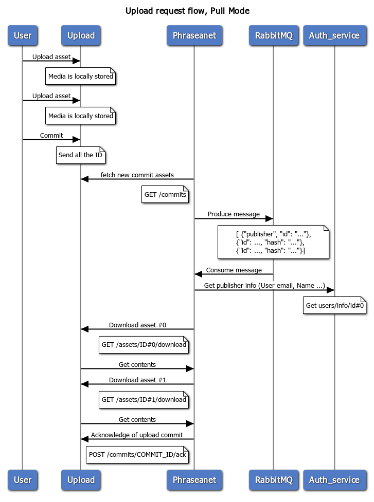

# Request Flow

The Uploader service supports two main modes for asset delivery: **Push Mode** and **Pull Mode**. These modes determine how Phraseanet is notified and how it retrieves uploaded assets.

## Push Mode

When an asset is uploaded, the Uploader service immediately notifies Phraseanet that a new asset is available. Phraseanet then downloads the media from the Uploader service.

### Sequence Diagram (Push Mode)


```
title Upload request flow, Push Mode

User->Upload: Upload asset
note over Upload: Media is locally stored
User->Upload: Upload asset
note over Upload: Media is locally stored
User->Upload: Commit
note over Upload: Send all the ID
Upload->Phraseanet: Notify there is a new asset
note left of Phraseanet: POST /api/v1/upload/enqueue
Phraseanet->RabbitMQ: Produce message
note over RabbitMQ
    [ {"publisher", "id": "..."},
    {"id": ..., "hash": "..."},
    {"id": ..., "hash": "..."}]
end note
RabbitMQ->Phraseanet: Consume message
Phraseanet->Auth_service: Get publisher info (User email, Name ...)
note over Auth_service: Get users/info/id#0

Phraseanet->Upload: Download asset #0
note left of Phraseanet: GET /assets/ID#0/download
Upload->Phraseanet: Get contents
Phraseanet->Upload: Download asset #1
note left of Phraseanet: GET /assets/ID#1/download
Upload->Phraseanet: Get contents
Phraseanet->Upload: Acknowledge of upload commit
note left of Phraseanet: POST /commits/COMMIT_ID/ack
```

## Pull Mode

In Pull Mode, the Uploader service does not notify Phraseanet immediately. Instead, Phraseanet periodically fetches new commits and downloads the assets.

### Sequence Diagram (Pull Mode)



```
title Upload request flow, Pull Mode

User->Upload: Upload asset
note over Upload: Media is locally stored
User->Upload: Upload asset
note over Upload: Media is locally stored
User->Upload: Commit
note over Upload: Send all the ID
Phraseanet->Upload: fetch new commit assets
note left of Phraseanet: GET /commits
Phraseanet->RabbitMQ: Produce message
note over RabbitMQ
    [ {"publisher", "id": "..."},
    {"id": ..., "hash": "..."},
    {"id": ..., "hash": "..."}]
end note
RabbitMQ->Phraseanet: Consume message
Phraseanet->Auth_service: Get publisher info (User email, Name ...)
note over Auth_service: Get users/info/id#0

Phraseanet->Upload: Download asset #0
note left of Phraseanet: GET /assets/ID#0/download
Upload->Phraseanet: Get contents
Phraseanet->Upload: Download asset #1
note left of Phraseanet: GET /assets/ID#1/download
Upload->Phraseanet: Get contents
Phraseanet->Upload: Acknowledge of upload commit
note left of Phraseanet: POST /commits/COMMIT_ID/ack
```

---

For more on the uploader setup and configuration, see [Uploader Setup](./02_setup.md) and [Uploader Configuration](./configuration.md).

