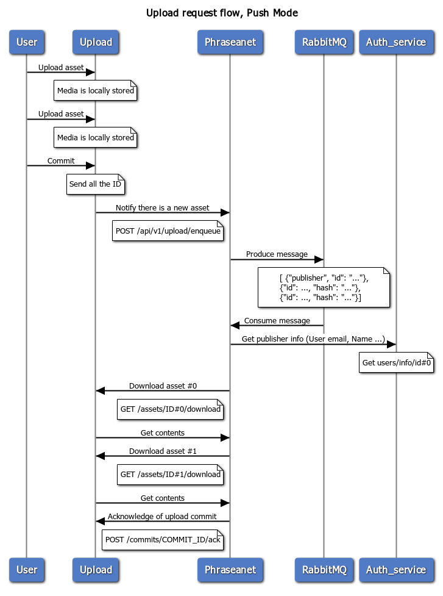

> **Statut :** _Travail en cours_  
> Cette page de documentation est en cours de rédaction et peut être fréquemment mise à jour.

# Uploader client et administrateur

## Vocabulaire

- **Target** : Destination pour les fichiers  
- **Form-editor** : Ensemble de widgets disponibles via la bibliothèque liform, permettant la création d’un formulaire d’indexation accessible à l'utilisateur.  
- **Target Parameter Editor** : Données d’indexation supplémentaires, non accessibles à l’utilisateur.  
- **Asset** : Fichier téléversé.   
- **Commit** : Ensemble regroupant les assets et les informations saisies dans le formulaire de la target (au format JSON)    
- **Multipart upload** : Les fichiers envoyés sont découpés en parties (chunks) et rassemblés côté serveur une fois l’upload terminé.

## Concepts de base

- Le service Uploader de Phrasea est constitué d’une API, d’une interface utilisateur nommée “Uploader client” et d’un “worker”. Ces trois composants s’appuient sur un système de fichiers, une base de données, des serveurs de cache et un bus de messages. Les composants peuvent être scalés selon les besoins.  
- L’Uploader contient des Targets.   
- À chaque Target est associé un formulaire, constitué de différents widgets.   
  - Le formulaire permet à l’utilisateur qui dépose des fichiers de saisir des informations relatives au lot de fichiers envoyé.  
  - La définition du formulaire s’effectue dans un éditeur en ligne.   
- L’envoi de fichiers via une Target est soumis à des droits sur des groupes.  
- Une destination peut être définie pour chaque Target.    
  - Une Target peut être :   
    - Une collection Phrasea  
    - Une collection Phraseanet  
    - Une application tierce

- Par défaut, la base de comptes est celle du realm “Phrasea” dans Keycloak.  
  - Le service Uploader utilise un client OAuth dans Keycloak pour l’authentification.

## Cinématique d’ajout de fichier avec l’interface Uploader client

Cette section décrit les étapes principales et les actions déclenchées lors d’un ajout de fichiers avec l’Uploader client vers Databox.

### Interaction entre l’Uploader et Phrasea Databox



- Un utilisateur s’authentifie.  
- Des Targets lui sont présentées, selon son groupe d’appartenance.  
  - L’utilisateur sélectionne une Target.  
  - L’utilisateur sélectionne des fichiers via :
    - Sélecteur de fichiers
    - Glisser-déposer
    - Coller depuis le presse-papiers (images uniquement)
    - Saisie d’une URL de fichier

  - L’utilisateur passe à l’écran suivant pour compléter le formulaire.

- L’upload des fichiers commence en tâche de fond.   
  - L’utilisateur complète et valide le formulaire.   
    - Une fois tous les fichiers reçus par le service Uploader, la destination définie dans la Target est notifiée qu’un lot de fichiers est disponible :   
      - Phrasea Databox   
      - Phraseanet   
      - Application tierce pouvant déclarer un endpoint écoutant les notifications émises

    - Le worker Databox commence la création d’un asset par fichier inclus dans le lot et télécharge le fichier depuis le stockage Uploader configuré dans la stack.  
    - Les informations issues du formulaire servent à renseigner les attributs du lot de fichiers envoyé.

> *Systèmes de fichiers supportés par le service Uploader et exigences minimales*

L’Uploader est compatible avec un stockage S3. Pour un fonctionnement optimal, le système de fichiers doit supporter certaines fonctionnalités (voir la documentation correspondante).  
Les systèmes testés et validés sont AWS S3 et Minio (voir la documentation de la stack, attention aux conteneurs utilisés en tant que primary datastore).  
Pour une utilisation optimale, l’Uploader supporte :   
- L’upload multipart, permettant de transmettre des fichiers volumineux  
- Les capacités techniques, comme la taille maximale acceptée, dépendent du système de fichiers utilisé

## Paramétrage

### Uploader et Phrasea Databox

Paramétrage d’une Target pour Phrasea   

#### Paramétrage Databox

Dans l’application Databox client, sur un workspace :

![][image1]

Définir une nouvelle intégration “Uploader” :

- L’intégration est propre au workspace et doit être définie pour chacun d’eux.

#### Paramétrage Uploader admin

Le paramétrage côté Uploader se fait via l’interface d’administration :

- Ajouter une Target dans upload > target

![][image2]  

- Paramètres à saisir, obtenus lors de la création de l’intégration “Uploader” Databox :  
  - “Target URL” : le point de terminaison côté “Phrasea” où seront notifiés les ajouts de fichiers  
  - Authorization key : clé d’authentification générée lors de la création de l’intégration  
  - Authorization Scheme : description du mécanisme d’authentification à utiliser pour les échanges Uploader > Databox

![][image3]

```yaml
# URL de base de l’API Uploader
baseUrl:
# ID de la collection cible (optionnel)
collectionId:         ~
# Clé de sécurité pour authentifier les requêtes Uploader
securityKey:    
```

### Uploader et Phraseanet

Paramétrage de la Target.  
En mode Push, le fonctionnement de l’Uploader avec Phraseanet est identique dans la mécanique ; seuls quelques paramètres changent.

## Paramétrage d’un formulaire de Target

### Form-editor

Dans l’interface client Uploader ou depuis Uploader admin/form-editor  
Documentation et exemple de [formulaire](../../tech/Uploader/form_config.md)  
   
Cliquer sur une Target.

L’éditeur de formulaire permet de décrire le formulaire en JSON et d’en voir le rendu instantané.

Exemple :

![][image4] todo

### Target Parameter Editor

Le “Target Parameter Editor” permet de passer des paramètres supplémentaires inclus dans une section du JSON pour décrire l’asset.

Les paramètres définis dans le “Target Parameter Editor” prévalent sur les informations saisies dans le form-editor. Il est donc inutile de déclarer des valeurs d’attribut dans le formulaire si celles-ci sont déjà référencées dans les paramètres de la Target.

![][image5] todo

## Notifications possibles

Il est possible de notifier l’émetteur via Uploader. Comme les autres modules, le module “Uploader” intègre Novu pour la gestion des notifications.

## FAQ

**Pourquoi un service externe ?**

- Cela permet d’isoler l’ajout de fichiers dans une interface dédiée  
  - Sans donner accès à l’intégralité du DAM  
  - Une interface réduite à l’essentiel pour les utilisateurs  
  - Peut fonctionner en mode “Pull” : l’application consommatrice interroge l’Uploader depuis une zone sécurisée à la fréquence de son choix (le mode “Pull” n’est pas encore disponible pour Phrasea)

**Pourquoi Form-editor et Target-editor ?**

- Le Form-editor permet de construire un formulaire utilisable par l’utilisateur  
- Le Target Parameter Editor permet d’ajouter des valeurs au lot d’assets sans passer par le formulaire ; ces valeurs ne sont pas accessibles à l’utilisateur déposant les assets
