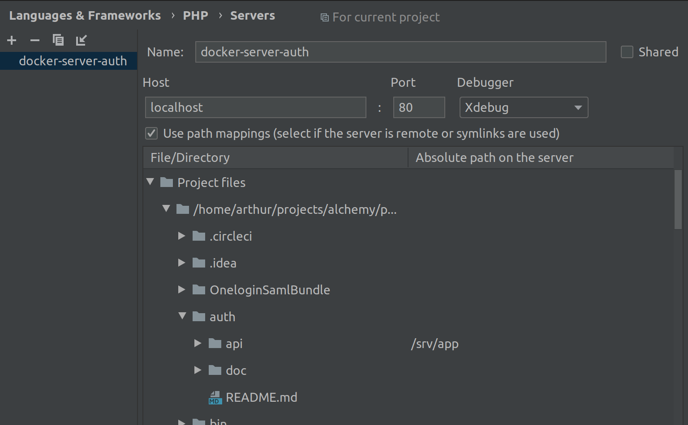

# Debugging PHP application with Xdebug

Xdebug is enabled in each PHP application by default in the `docker-compose.override.yml`
You can disable it with:

```bash
export XDEBUG_ENABLED=0
docker-compose up -d
```

Remote host is fixed because of the subnet network from compose.

You need to configure file mapping in your IDE.

Each application should have its server configured in PhpStorm.
Each server name should follow the following pattern: `server-docker-SERVICE` (i.e. `server-docker-auth`).
Then you need to enable path mappings for the server. See the example below:



> Configure the `Absolute path on the server` to `/srv/app` at the application project path (i.e. `~/projects/phraseanet-services/auth/api` in this case).

For the uploader application you would have:
- a server named `server-docker-uploader` in PhpStorm
- set the path mapping: `~/projects/phraseanet-services/uploader/api` ->  `/srv/app`
