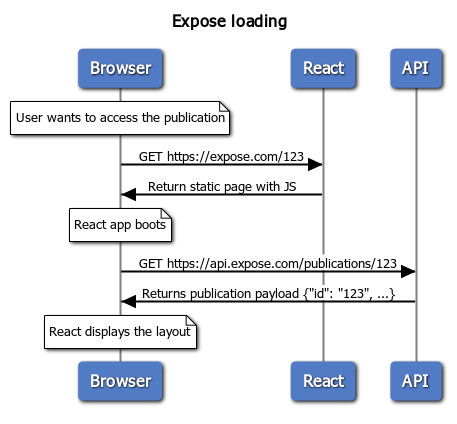

# Expose service

Expose service is part of the Alchemy ecosystem.
Its role is to expose assets to the Internet.

Service wraps the following end projects:
- Expose API (back end)

## How it works

Please first have a look at [publication payload reference](./api/README.md)!

First entrypoint is the React app with one main route:

`/p/{id}` (or maybe with a token: `/p/{id}/{token}`)

The React app displays a loader while querying the expose API to fetch the publication:

`GET [API_HOST]/p/{id}`

If there is no protection, the response will contain all the publication payload.
Otherwise the response will be limited to protection method:
```json
{
  "id": "123",
  "security": {
      "protection_method": "password | authentication | url_token",
      "password": "s3cr3t",
      "required_roles": []
  }
}
```

Then front (React) application will display the according authentication method and request the publication payload again:

- with secret token: `GET [API_HOST]/p/{id} --header "Authorization: Token {token}"`
- with password: `GET [API_HOST]/p/{id} --header "Authorization: Password {password}"`


In this example we access the publication at:
`https://client-url.com/gallery/123`

### Sequence



​```sequence
title Expose loading

note over Browser: User wants to access the publication
Browser->React: GET https://expose.com/123
React->Browser: Return static page with JS
note over Browser: React app boots
Browser->API: GET https://api.expose.com/publications/123
API->Browser: Returns publication payload {"id": "123", ...}
note over Browser: React displays the layout
​```

## Definitions

At the top level, we have *layouts*:
- download (display thumbnail while downloading the whole package)
- gallery (simple web gallery)
- lightbox (an extended web gallery with actions on files)

At the second level, we have *themes*.
Themes are declined graphical versions of layouts.
A theme should be implemented for each layout.

## Direct URL access

We can define a unique URL path for an asset:

```json
{
  "id": "123",
  "assetId": "my-unique-id",
  "alternateUrl": "a/b/c"
}
```

Asset will be accessible at `https://client-url.com/direct/{alternateUrl}`.


## Setup

Override environment variables defined in `.env` file:

```bash
DEV_MODE=false
EXPOSE_CLIENT_ID=<THE_CLIENT_ID> # NOT the client ID from Phraseanet
EXPOSE_CLIENT_RANDOM_ID=<A_RANDOM_HASH>
EXPOSE_CLIENT_SECRET=<A_SECRET> # NOT the client secret from Phraseanet
ASSET_CONSUMER_COMMIT_URI=https://alpha.preprod.alchemyasp.com/api/v1/upload/enqueue/
ASSET_CONSUMER_ACCESS_TOKEN=<THE_TOKEN_GOT_FROM_PHRASEANET_APPLICATION>
```

## Development

In order to avoid commit request to consumer target, you can define `ASSET_CONSUMER_ACCESS_TOKEN=avoid`.

# Further reading

- [Request flow](./doc/request_flow.md)
- [Form configuration](./doc/form_config.md)
- [Form steps](./doc/form-steps.md)
