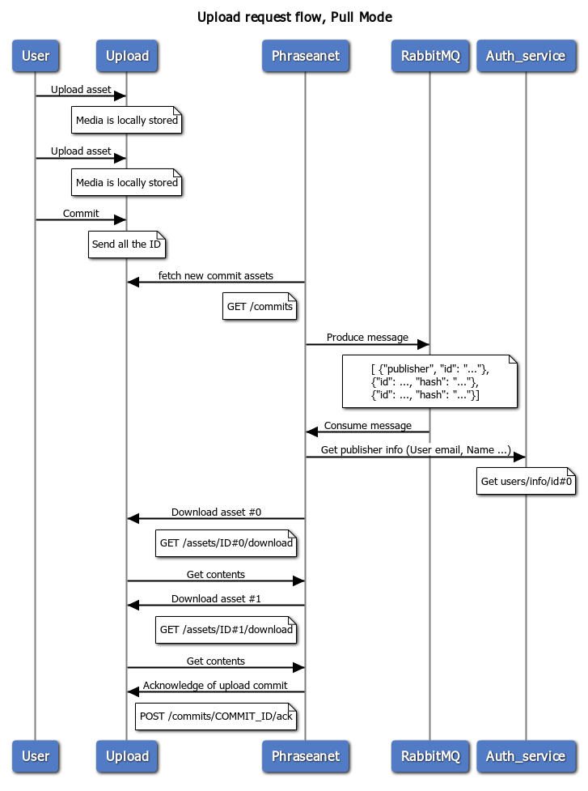

# Request flow

Push Mode
When an asset is uploaded to the upload service, the upload service notifies Phraseanet that there is a new asset to grab.
Then Phraseanet download the media through the upload service.

Pull Mode
When an asset is uploaded to the upload service, the upload service don't notifies
Phraseanet fetch commit within timing interval

## Flow Push Mode


​``` sequence
title Upload request flow, Push Mode

User->Upload: Upload asset
note over Upload: Media is locally stored
User->Upload: Upload asset
note over Upload: Media is locally stored
User->Upload: Commit
note over Upload: Send all the ID
Upload->Phraseanet: Notify there is a new asset
note left of Phraseanet: POST /api/v1/upload/enqueue
Phraseanet->RabbitMQ: Produce message
note over RabbitMQ
    [ \{"publisher", "id": "..."},
    \{"id": ..., "hash": "..."},
    \{"id": ..., "hash": "..."}]
end note
RabbitMQ->Phraseanet: Consume message
Phraseanet->Auth_service: Get publisher info (User email, Name ...) 
note over Auth_service: Get users/info/id#0

Phraseanet->Upload: Download asset #0
note left of Phraseanet: GET /assets/ID#0/download
Upload->Phraseanet: Get contents
Phraseanet->Upload: Download asset #1
note left of Phraseanet: GET /assets/ID#1/download
Upload->Phraseanet: Get contents
Phraseanet->Upload: Acknowledge of upload commit
note left of Phraseanet: POST /commits/COMMIT_ID/ack
​```

## Flow Pull mode



```
title Upload request flow, Pull Mode

User->Upload: Upload asset
note over Upload: Media is locally stored
User->Upload: Upload asset
note over Upload: Media is locally stored
User->Upload: Commit
note over Upload: Send all the ID
Phraseanet->Upload: fetch new commit assets
note left of Phraseanet: GET /commits
Phraseanet->RabbitMQ: Produce message
note over RabbitMQ
    [ \{"publisher", "id": "..."},
    \{"id": ..., "hash": "..."},
    \{"id": ..., "hash": "..."}]
end note
RabbitMQ->Phraseanet: Consume message
Phraseanet->Auth_service: Get publisher info (User email, Name ...) 
note over Auth_service: Get users/info/id#0

Phraseanet->Upload: Download asset #0
note left of Phraseanet: GET /assets/ID#0/download
Upload->Phraseanet: Get contents
Phraseanet->Upload: Download asset #1
note left of Phraseanet: GET /assets/ID#1/download
Upload->Phraseanet: Get contents
Phraseanet->Upload: Acknowledge of upload commit
note left of Phraseanet: POST /commits/COMMIT_ID/ack
```

## Phraseanet entrypoint

In order to let Phraseanet know there are new asset to grab, Upload service must notify it.

The following request is made by Upload:

```bash
curl -X POST -H "Content-Type: application/json" https://<PHRASEANET_HOST>/api/v1/upload/enqueue -d'{
    "assets": ["4c097077-a26b-4af4-9a5d-b13fd4c77b3d", "a134145e-9461-4f0a-8bd8-7025d31a6b8e"],
    "publisher": "d03fc9f6-3c6b-4428-8d6f-ba07c7c6e856",
    "token": "f87...700b7cd"
}'
```

> In the last request example, 2 assets are ready to be downloaded with ID `4c097077-a26b-4af4-9a5d-b13fd4c77b3d` and `a134145e-9461-4f0a-8bd8-7025d31a6b8e`.

Then, Phraseanet download each asset with provided ID:

```bash
curl -X GET --header "Authorization: AssetToken f87...700b7cd" https://<UPLOAD_HOST>/assets/<ID>/download
```

> Note that we use a custom authorization type called `AssetToken` (relates to an asset).

And also get metadata:

```bash
curl -X GET --header "Authorization: AssetToken f87...700b7cd" https://<UPLOAD_HOST>/assets/<ID>
```

You will get a similar response like:

```json
{
  "id": "d7c40d3f-06b6-40ba-88e6-397159c14ed7",
  "size": 151791,
  "formData": {
    "title": "Test document"
  },
  "originalName": "test.png",
  "mimeType": "image/png",
  "createdAt": "2019-05-15T14:13:54+00:00"
}
```
